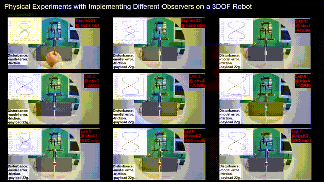

<!--  -->
<!--   
You can also find my articles on <a href="{{site.author.googlescholar}}">my Google Scholar profile</a>.
 -->
<!--  -->


<!--  -->

A list of these publications can be also found on my [Google Scholar](https://scholar.google.com/citations?user=lY0vLa0AAAAJ&hl=en) profile.

<!--  -->
<!--    -->
<!--  -->

------------

**Table of Contents**

* This line is needed for generating TOC (Table of Contents), but won't appear. Replace '*' with '1' to create a numbered list.
{:toc}

------------

Papers in journals
------

1. **Teng Li**. "A Teleoperation System with Impedance Control and Disturbance Observer for Robot-Assisted Rehabilitation".  arXiv, arXiv:2412.03619, pp. 1-10, **2024**. _( with two 2DOF Quanser's Rehabilitation robots )_ [[arXiv](https://doi.org/10.48550/arXiv.2412.03619)] [[Demo Video](https://youtu.be/Jokv_RPOXEc)] [[PDF](../teng4_Papers/p010_arXiv_teleOP/2412.03619v1.pdf)]

      | _Demo video (click to watch the full video)_ |
      |  |

      | 
 ABSTRACT: Physical movement therapy is a crucial method of rehabilitation aimed at reinstating mobility among patients facing motor dysfunction due to neurological conditions or accidents. Such therapy is usually featured as patient-specific, repetitive, and labor-intensive. The conventional method, where therapists collaborate with patients to conduct repetitive physical training, proves strenuous due to these characteristics. The concept of robot-assisted rehabilitation, assisting therapists with robotic systems, has gained substantial popularity. However, building such systems presents challenges, such as diverse task demands, uncertainties in dynamic models, and safety issues. To address these concerns, in this paper, we proposed a bilateral teleoperation system for rehabilitation. The control scheme of the system is designed as an integrated framework of impedance control and disturbance observer where the former can ensure compliant human-robot interaction without the need for force sensors while the latter can compensate for dynamic uncertainties when only a roughly identified dynamic model is available. Furthermore, the scheme allows free switching between tracking tasks and physical human-robot interaction (pHRI). The presented system can execute a wide array of pre-defined trajectories with varying patterns, adaptable to diverse needs. Moreover, the system can capture therapists' demonstrations, replaying them as many times as necessary. The effectiveness of the teleoperation system is experimentally evaluated and demonstrated. 
 |

1. **Teng Li**, Armin Badre, and Mahdi Tavakoli. "Robotic Assistance and Haptic Feedback in Arthroscopic Procedures: Design and Preliminary Evaluation of a Two-Arm System".  Journal of Medical Robotics Research (JMRR), 09(03n04):2450004, **2024**. _( with two 6DOF Quanser's HD2 robots )_ [[World Scientific](https://doi.org/10.1142/S2424905X24500041)] [[Demo Video](https://youtu.be/L1JoCNC9hhA)] [[ResearchGate](https://www.researchgate.net/publication/380689222_Robotic_Assistance_and_Haptic_Feedback_in_Arthroscopic_Procedures_Design_and_Preliminary_Evaluation_of_a_Two-Arm_System)]

      | _Demo video (click to watch the full video)_ |
      |  |

      | 
 ABSTRACT: Robot-assisted arthroscopic surgery has been receiving growing attention in the field of orthopedic surgery. Most of the existing robot-assisted surgical systems in orthopedics place more focus on open surgery than minimally invasive surgery (MIS). In traditional arthroscopic surgery, the surgeon needs to hold an arthroscope with one hand while performing the surgical operations with the other hand, which can restrict the dexterity of the surgical performance and increase the cognitive load. On the other hand, the surgeon heavily relies on the arthroscope view when conducting the surgery, whereas the arthroscope view is a largely localized view and lacks depth information. To assist the surgeon in both scenarios, in this work, we develop a two-arm robotic system. The left-arm robot is used as a robot-assisted arthroscope holder, and it can hold the arthroscope still at a designated pose and reject all other potential disturbances, while also allowing the operator to move it via a pedal switch whenever needed. The left-arm robot is implemented with an impedance controller and a gravity iterative learning (Git) scheme, where the former can provide compliant robot behavior, thus ensuring a safe human-robot interaction, while the latter can accurately learn for gravity compensation. The right-arm robot is used as a robot-assisted surgical tool, providing virtual fixture (VF) assistance and haptic feedback during the surgery. The right-arm robot is implemented with a point-based VF algorithm, which can generate VF directly from point clouds in any shape, render force feedback, and deliver it to the operator. Furthermore, the VF, the bone, and the surgical tool position are visualized in a 3D digital environment as additional visual feedback for the operator. A series of experiments are conducted to evaluate the effectiveness of the prototype. The results demonstrate that both arms can provide satisfactory assistance as designed. 
 |

2. **Teng Li**, Amir Zakerimanesh, Yafei Ou, Armin Badre, and Mahdi Tavakoli. "Iterative Learning for Gravity Compensation in Impedance Control".  IEEE/ASME Transactions on Mechatronics (TMECH), pp. 1-12, **2024**. _( with a 3DOF PHANToM Premium 1.5A robot )_ [[IEEE Xplore](https://ieeexplore.ieee.org/document/10507161)] [[Demo Video](https://youtu.be/2BzboHYSa68)] [[ResearchGate](https://www.researchgate.net/publication/380049055_Iterative_Learning_for_Gravity_Compensation_in_Impedance_Control)]

      | _Demo video (click to watch the full video)_ |
      |  |

      | 
 ABSTRACT: Robot-assisted arthroscopic surgery has been increasingly receiving attention in orthopedic surgery. To build a robot-assisted system, dynamic uncertainties can be a critical issue that could bring robot performance inaccuracy or even system instability if cannot be appropriately compensated. Disturbance observer is a common tool to be used for disturbance estimation and compensation by taking all uncertainties as disturbances, but this will refuse human-robot interaction since the human-applied force will also be regarded as a disturbance by the observer. Iterative learning for gravity compensation can be another promising way to solve this problem when gravity compensation is the main concern. In this paper, a gravity iterative learning (Git) scheme in Cartesian space for gravity compensation, integrating with an impedance controller, is presented. A steady-state scaling strategy is then proposed which released the updating requirements of the learning scheme and also extended its validity to trajectory-tracking scenarios from set-point regulations. The deriving process and convergence properties of the Git scheme are presented and theoretically analyzed, respectively. A series of simulations and physical experiments are conducted to evaluate the validity of the scaling strategy, the learning accuracy of the Git scheme, and the effectiveness of the learning-based impedance controller. Both simulation and experimental results demonstrate good performance and properties of the Git scheme and the learning-based impedance controller. 
 |

3. **Teng Li**, Hongjun Xing, Ehsan Hashemi, Hamid D. Taghirad, Mahdi Tavakoli. "A Brief Survey of Observers for Disturbance Estimation and Compensation".  Robotica, 41(12), 3818–3845, **2023**. Cambridge University Press. _( with a 3DOF PHANToM Premium 1.5A robot )_ [[Robotica OA](https://doi.org/10.1017/S0263574723001091)] [[Demo Video](https://youtu.be/6ePnym57jPU)] [[ResearchGate](https://www.researchgate.net/publication/374229090_A_Brief_Survey_of_Observers_for_Disturbance_Estimation_and_Compensation)]

      | _Demo video (click to watch the full video)_ |
      |  |

      | 
 ABSTRACT: An accurate dynamic model of a robot is fundamentally important for a control system, while uncertainties residing in the model are inevitable in a physical robot system. The uncertainties can be categorized as internal disturbances and external disturbances in general. The former may include dynamic model errors and joint frictions, while the latter may include external payloads or human-exerted force to the robot. Disturbance observer is an important technique to estimate and compensate for the uncertainties of the dynamic model. Different types of disturbance observers have been developed to estimate the lumped uncertainties so far. In this paper, we conducted a brief survey on five typical types of observers from a perspective of practical implementation in a robot control system, including generalized momentum observer (GMO), joint velocity observer (JVOB), nonlinear disturbance observer (NDOB), disturbance Kalman filter (DKF), and extended state observer (ESO). First, we introduced the basics of each observer including equations and derivations. Two common types of disturbances are considered as two scenarios, that is, constant external disturbance and time-varying external disturbance. Then, the observers are separately implemented in each of the two simulated scenarios, and the disturbance tracking performance of each observer is presented while their performance in the same scenario has also been compared in the same figure. Finally, the main features and possible behaviors of each type of observer are summarized and discussed. This survey is devoted to helping readers learn the basic expressions of five typical observers and implement them in a robot control system. 
 |

4. **Teng Li**, Armin Badre, Farshid Alambeigi, and Mahdi Tavakoli. "Robotic Systems and Navigation Techniques in Orthopedics: A Historical Review".  Applied Sciences, Section: Robotics and Automation, Special Issue: Surgical Robotics Design and Clinical Applications. 13(17):9768, **2023**. [[MDPI-applsci](https://www.mdpi.com/2076-3417/13/17/9768)] [[ResearchGate](https://www.researchgate.net/publication/373484618_Robotic_Systems_and_Navigation_Techniques_in_Orthopedics_A_Historical_Review)]

      | _Figure: Robotic systems (RSs) in the timeline._ |
      |  |

      | 
 ABSTRACT: Since the da Vinci surgical system was approved by the Food and Drug Administration (FDA) in 2000, the development and deployment of various robot-assisted minimally invasive surgery (MIS) systems have been largely expedited and boomed. With the rapid advancement of robotic techniques in recent decades, robot-assisted systems have been widely used in various surgeries including orthopedics. These robot-related techniques are transforming the conventional ways to conduct surgical procedures. Robot-assisted orthopedic surgeries have become more and more popular due to their potential benefits of increased accuracy and precision in surgical outcomes, enhanced reproducibility, reduced technical variability, decreased pain, and faster recovery time. In this paper, robotic systems and navigation techniques in typical orthopedic surgeries are reviewed, especially for arthroplasty. From the perspective of robotics and engineering, the systems and techniques are divided into two main categories, i.e., robotic systems (RSs), and computer-aided navigation systems (CANSs). The former is further divided into autonomous RS, hands-on RS, and teleoperated RS. For the latter, three key elements in CANS are introduced, including 3D modeling, registration, and navigation. Lastly, the potential advantages and disadvantages of the RS and CANS are summarized and discussed. Future perspectives on robotics in orthopedics, as well as the challenges, are presented. 
 |

5. **Teng Li**, Xiao Meng, and Mahdi Tavakoli. "Dual Mode pHRI-teleHRI Control System with A Hybrid Admittance-Force Controller for Ultrasound Imaging".  Sensors, Section: Sensors and Robotics, Special Issue: Sensors Technology for Medical Robotics. 22(11):4025, **2022**.   _( with a 7DOF Franka Emika Panda robot )_ [[MDPI](https://www.mdpi.com/1424-8220/22/11/4025/htm)] [[Demo Video](https://youtu.be/NkqlawDmJrM)]  [[ResearchGate](https://www.researchgate.net/publication/360969094_Dual_Mode_pHRI-teleHRI_Control_System_with_a_Hybrid_Admittance-Force_Controller_for_Ultrasound_Imaging)]

      | _Demo video (click to watch the full video)_ |
      |  |

      | 
 ABSTRACT: The COVID-19 pandemic has brought unprecedented extreme pressure on the medical system due to the physical distance policy, especially for procedures such as ultrasound (US) imaging, which are usually carried out in person. Tele-operation systems are a promising way to avoid physical human-robot interaction (pHRI). However, the system usually requires another robot on the remote doctor side to provide haptic feedback, which makes it expensive and complex. To reduce the cost and system complexity, in this paper, we present a low-cost, easy-to-use, dual-mode pHRI-teleHRI control system with a custom-designed hybrid admittance-force controller for US imaging. The proposed system requires only a tracking camera rather than a sophisticated robot on the remote side. An audio feedback is designed for replacing haptic feedback on the remote side, and its sufficiency is experimentally verified. The experimental results indicate that the designed hybrid controller can significantly improve the task performance in both modes. Furthermore, the proposed system enables the user to conduct US imaging while complying with the physical distance policy, and allows them to seamlessly switch modes from one to another in an online manner. The novel system can be easily adapted to other medical applications beyond the pandemic, such as tele-healthcare, palpation, and auscultation. 
 |

------------

Papers in conferences
------
1. **Teng Li**, Sunny Zhang, Thomas Looi, and Dale J Podolsky. "A Framework of Real2Sim Teleoperation System for Evaluating Surgical Robotic Tool Design".  2025 International Symposium on Medical Robotics _(ISMR 2025)_, May 14-16, Georgia Tech, Atlanta, GA, USA, **2025**. pp. 1-7. _( with a 6DOF Phantom Omni robot )_ [[IEEE Xplore]()] [[Demo Video](https://youtu.be/8UOYpi7Yun8)]  [[ResearchGate]()] [Accepted]

      | _Demo video (click to watch the full video)_ |
      |  |

      | 
 ABSTRACT: During the process of designing a surgical robotic tool, a teleoperation system is necessary to evaluate the tool design in a simulated environment via virtual surgical tasks. It is possible to build such a system by involving a physical da Vinci Surgical System (dVSS) and using its master tool manipulator (MTM) to teleoperate the virtual robotic tool for evaluation. However, extensive testing and debugging require a more general and portable teleoperation system. In this work, we propose a general framework for establishing a real-to-sim teleoperation system. In the system, the real robot's Cartesian pose is first transformed, scaled, and mapped into the sim robot's coordinate system. Then, the resulting pose, as the desired pose of the sim robot, will proceed through a numerical inverse kinematics (IK) solver. The numerical IK solution is used to update the current joint configuration of the sim robot, which enables an independent and compact teleoperation system. Additionally, the numerical IK solution can be channeled to other simulation platforms for visualizing the sim robot with joint command control, where various virtual surgical tasks can be designed and conducted for further tool evaluation. Preliminary experiments were conducted to evaluate an established Omni-to-Unity teleoperation system, and the system's stability, accuracy, and usability were assessed and verified by the experimental results. The established teleoperation system can be used to streamline and facilitate robotic tool design and evaluation. Furthermore, the proposed real2sim framework can be easily adapted to a variety of application scenarios where both the real and sim robots can be specified by the user for different purposes. 
 |

1. **Teng Li**, Armin Badre, Hamid D. Taghirad, and Mahdi Tavakoli. "Point-Based 3D Virtual Fixture Generating for Image-Guided and Robot-Assisted Surgery in Orthopedics".  2023 IEEE/ASME International Conference on Advanced Intelligent Mechatronics _(AIM 2023)_, June 28-30, Seattle, Washington, USA, **2023**. pp. 179-186. DOI: 10.1109/AIM46323.2023.10196130. _( with a 7DOF Franka Emika Panda robot )_ [[IEEE Xplore](https://ieeexplore.ieee.org/document/10196130)] [[Demo Video](https://youtu.be/ROSREHC9zU0)]  [[ResearchGate](https://www.researchgate.net/publication/371782677_Point-Based_3D_Virtual_Fixture_Generating_for_Image-Guided_and_Robot-Assisted_Surgery_in_Orthopedics)]

      | _Demo video (click to watch the full video)_ |
      |  |

      | 
 ABSTRACT: Virtual fixture (VF) has been playing a vital role in robot-assisted surgeries, such as guiding surgical tools' movement and protecting a beating heart. In orthopedic surgery, preplanned images are often used in the operating room, on which planning curves might be drawn, for instance, to mark out the boundaries for osteophytes to be removed. These curves can be used to generate VF to assist in removing osteophytes during the operation. A challenge is that the hand-drawn curves usually have a random shape and cannot be mathematically represented by equations, thus most of the existing algorithms will not work in this scenario. In this paper, an algorithm of VF generating based on point clouds is presented, with which VF can be generated directly from cloud points, for example, point clouds of hand-drawn curves extracted from an image. The effectiveness of the VF algorithm is evaluated by a series of simulations and experiments. The VF algorithm is also tested in an image-based scenario and its effectiveness is demonstrated. The presented point-based VF algorithm is promising to be used in various applications in image-guided surgery to generate VF for objects with various shapes. 
 |

2. **Teng Li**, Armin Badre, Hamid D. Taghirad, and Mahdi Tavakoli. "Neural Network Learning of Robot Dynamic Uncertainties and Observer-Based External Disturbance Estimation for Impedance Control".  2023 IEEE/ASME International Conference on Advanced Intelligent Mechatronics _(AIM 2023)_, June 28-30, Seattle, Washington, USA, **2023**. pp. 591-597. DOI: 10.1109/AIM46323.2023.10196132. _( with a 3DOF PHANToM Premium 1.5A robot )_ [[IEEE Xplore](https://ieeexplore.ieee.org/document/10196132)]  [[ResearchGate](https://www.researchgate.net/publication/371782730_Neural_Network_Learning_of_Robot_Dynamic_Uncertainties_and_Observer-Based_External_Disturbance_Estimation_for_Impedance_Control)]

      | _Figure: Workflow of the proposed NN learning procedures._ |
      |  |

      | 
 ABSTRACT: Estimation of dynamic uncertainties is a critical and fundamental problem when designing a control system for a robot. During robot-environment interaction, in addition to the internal dynamic model uncertainties, the external environment-exerted force will also enter the dynamics. For robot impedance control, an exact dynamic model of the robot is needed but usually not available. It has been shown that integrating an impedance controller with a disturbance observer can achieve accurate impedance control. However, it works only for robots in free motion but not robot-environment interaction. Although a disturbance observer is able to accurately estimate the dynamic uncertainties, the estimation is lumped uncertainties that contain all uncertainty sources including both the internal and the external disturbances. Without separating these two parts, the method of combining an impedance controller and an observer will result in the human-applied force being canceled instead of interacting with the robot. To solve this problem in this paper, we propose a framework for learning the internal disturbances and separating the external disturbances by integrating three entities: an impedance controller, a neural network (NN) model, and a disturbance observer. In the framework, the impedance controller provides compliant robot behavior, while the observer captures the lumped uncertainties, and the NN learns to separate the external disturbances. Simulation results of an application scenario with an obstructive virtual fixture demonstrate the effectiveness of the proposed framework. 
 |

3. **Teng Li**, Armin Badre, Hamid D. Taghirad, and Mahdi Tavakoli. "Integrating Impedance Control and Nonlinear Disturbance Observer for Robot-Assisted Arthroscope Control in Elbow Arthroscopic Surgery". In  2022 IEEE/RSJ International Conference on Intelligent Robots and Systems _(IROS 2022)_, October 23-27, Kyoto, Japan, **2022**, pp. 11172-11179. doi: 10.1109/IROS47612.2022.9981208. _( with a 3DOF PHANToM Premium 1.5A robot )_ [[IEEE Xplore](https://ieeexplore.ieee.org/document/9981208)] [[Demo Video](https://youtu.be/f54Iah0yuWk)]  [[ResearchGate](https://www.researchgate.net/publication/364676968_Integrating_Impedance_Control_and_Nonlinear_Disturbance_Observer_for_Robot-Assisted_Arthroscope_Control_in_Elbow_Arthroscopic_Surgery)]

      | _Demo video (click to watch the full video)_ |
      |  |

      | 
 ABSTRACT: Robot-assisted arthroscopic surgery is transforming the tradition in orthopaedic surgery. Compliance and stability are essential features that a surgical robot must have for safe physical human-robot interaction (pHRI). Surgical tools attached at the robot end-effector and human-robot interaction will affect the robot dynamics inevitably. This could undermine the utility and stability of the robotic system if the varying robot dynamics are not identified and updated in the robot control law. In this paper, an integrated framework for robot impedance control and nonlinear disturbance observer (NDOB)-based compensation of uncertain dynamics is proposed, where the former ensures compliant robot behavior and the latter compensates for dynamic uncertainties when necessary. The combination of impedance controller and NDOB is analyzed theoretically in three scenarios. A complete simulation and experimental studies involving three common conditions are then conducted to evaluate the theoretical analyses. A preliminary pHRI application on arthroscopic surgery is designed to implement the proposed framework on a robotic surgeon-assist system and evaluate its effectiveness experimentally. By integrating impedance controller with NDOB, the proposed framework allows an accurate impedance control when dynamic model inaccuracy and external disturbance exist. 
 |

4. **Teng Li**, Hongjun Xing, Hamid D. Taghirad, and Mahdi Tavakoli. "EMG-Based Hybrid Impedance-Force Control for Human-Robot Collaboration on Ultrasound Imaging". In  2022 IEEE/RSJ International Conference on Intelligent Robots and Systems _(IROS 2022)_, October 23-27, Kyoto, Japan, **2022**, pp. 670-675. doi: 10.1109/IROS47612.2022.9981615. _( with a 7DOF Franka Emika Panda robot )_ [[IEEE Xplore](https://ieeexplore.ieee.org/document/9981615)] [[Demo Video](https://youtu.be/kgMYiFkA3qk)]  [[ResearchGate](https://www.researchgate.net/publication/364676896_EMG-based_Hybrid_Impedance-Force_Control_for_Human-Robot_Collaboration_on_Ultrasound_Imaging)]

      | _Demo video (click to watch the full video)_ |
      |  |

      | 
 ABSTRACT: Ultrasound (US) imaging is a common but physically demanding task in the medical field, and sonographers may need to put in considerable physical effort for producing high-quality US images. During physical human-robot interaction on US imaging, robot compliance is a critical feature that can ensure human user safety while automatic force regulation ability can help to improve task performance. However, higher robot compliance may mean lower force regulation accuracy, and vice versa. Especially, the contact/non-contact status transition can largely affect the control system stability. In this paper, a novel electromyography (EMG)-based hybrid impedance-force control system is developed for US imaging task. The proposed control system incorporates the robot compliance and force regulation ability via a hybrid controller while the EMG channel enables the user to online modulate the trade-off between the two features as necessary. Two experiments are conducted to examine the hybrid controller and show the necessity of involving an EMG-based modulator. A proof-of-concept study on US imaging is performed with implementing the proposed EMG-based control system, and the effectiveness is demonstrated. The proposed control system is promising to ensure robot's stability and patient's safety, thus obtain high-quality US images, while monitoring and reducing sonographer's fatigue. Furthermore, it can be easily adapted to other physically demanding tasks in the field of medicine. 
 |

5. **Teng Li**, Ali Torabi, Hongjun Xing, and Mahdi Tavakoli. "Improving A User’s Haptic Perceptual Sensitivity by Optimizing Effective Manipulability of A Redundant User Interface". In  2021 IEEE International Conference on Autonomous Systems _(ICAS 2021)_, August 11-13, Montreal, QC, Canada, **2021**, pp. 1–5. _( with a 4DOF planar robot )_ [[IEEE Xplore](https://ieeexplore.ieee.org/abstract/document/9551140)]  [[ResearchGate](https://www.researchgate.net/publication/353957917_IMPROVING_A_USER'S_HAPTIC_PERCEPTUAL_SENSITIVITY_BY_OPTIMIZING_EFFECTIVE_MANIPULABILITY_OF_A_REDUNDANT_USER_INTERFACE)]

      | _Figure: Setup with a redundant 4DOF planar robot._ |
      |  |

      | 
 ABSTRACT: Human perceptual sensitivity of various types of forces, e.g., stiffness and friction, is important for surgeons during robotic surgeries such as needle insertion and palpation. However, force feedback from robot end-effector is usually a combination of desired and undesired force components which could have an effect on the perceptual sensitivity of the desired one. In presence of undesired forces, to improve perceptual sensitivity of desired force could benefit robotic surgical outcomes. In this paper, we investigate how users' perceptual sensitivity of friction and stiffness can be improved by taking advantage of kinematic redundancy of a user interface. Experimental results indicated that the perceptual sensitivity of both friction and stiffness can be significantly improved by maximizing the effective manipulability of the redundant user interface in its null space. The positive results provide a promising perspective to enhance surgeons' haptic perceptual ability by making use of the robot redundancy. 
 |

------------

PhD Thesis
------

1. **Teng Li**. "Developing a Two-Arm Robot-Assisted System for Arthroscopic Surgery". PhD thesis, 202404. Specialization: Biomedical Engineering. Supervisor: [Mahdi Tavakoli](https://www.ece.ualberta.ca/~mtavakol/pmwiki/). Department: Department of Electrical and Computer Engineering. Institution: University of Alberta. pp. 1-216, April 2024. [[DOI](https://doi.org/10.7939/r3-7b82-rh23)]

------------

<!-- 
 
 This is a summary.
 
 -->
<!-- text goes here -->
<!--  this is the complete text being shown -->
<!-- more... -->

<!--  Some green text 01  (works in HTML page but not in GitHub.) -->
<!--  Some green text 02  (works in HTML page but not in GitHub. DarkGoldenRod, DarkKhaki, DarkSlateBlue,ForestGreen, RoyalBlue, LightGray ) -->
<!-- $\color[rgb]{1,0,1} hello 04$ (not work in HTML page.) -->
<!-- $\textcolor{red}{text 05}$ (not work in HTML page.) -->
<!-- $\textcolor{red}{This\ is\ a\ Big\ Title 06}$ (not work in HTML page.) -->
<!-- | _The proposed Git scheme is implemented in a simulated arthroscopic surgery scenario._ | -->
<!-- This is a image. --teng4note, use either method for image is ok, and use either absolut/relative path for image is also ok. -->
<!--  -->
<!-- This is a gif. -->
<!--  -->
<!-- Demo video (on Github): --teng4note, video not ok yet. -->
<!-- teng4_Papers/p008_TMECH_PDGit/TMECHfinalVideo.mp4 -->
<!-- Demo video (on Youtube): --teng4note, video not ok yet. -->
<!-- https://youtu.be/2BzboHYSa68 -->
