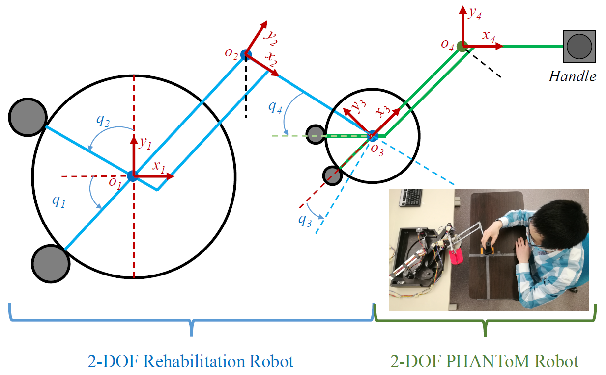

(20260122).

# How to export robot URDF file from SolidWorks?

This post describes the detailed procedures for exporting `URDF` files of a robot from SolidWorks.

**Test Environment:**

- SolidWorks 2022, running on a PC with Windows 11 OS.
- The resulting URDFs are tested in a catkin_ws on a PC with Ubuntu 20.0.
- ROS1, noetic, Ubuntu 20.04.6 LTS

**Main testbed:**

- Panda urdf export.
- Kuka urdf export.

## 1.	Install plugin tool (SW2URDF) in SolidWorks in Windows OS.

- Download “sw2urdfSetup.exe” from “SolidWorks to URDF Exporter (https://wiki.ros.org/sw_urdf_exporter )”
- Follow the instructions there, and install “sw2urdfSetup.exe”.
- If installation is successful, you should be able to find it in SolidWorks. When SolidWorks is open, under "Tools > Add-ins" you will see a `SW2URDF` item at the very bottom as shown below.

|  |
 

## 2.	Create a new assembly file (.SLDASM) in SolidWorks and Setup/Assemble the robot from parts.

In SolidWorks 2022 or other versions, create a new `filename.SLDASM` file, and rename it with your own file name, e.g., I rename mine as `“panda.SLDASM”`. 

*Note: This name has nothing to do with the names later in URDF files, so you can name it whatever you want. Actually, for any names outside of the URDF configuration interface, they do not affect the names inside the URDF, because you will need to type in the link/joint names manually inside the URDF configuration anyway when you reach there.*

Before proceeding, you should collect all the robot links’ parts (`.SLDPRT` files) into one dedicated folder, because later you will need to import them into the `panda.SLDASM` file one by one.

Now in the brand new panda.SLDASM file, import the first part which is the robot’s `“base”`, then put it anywhere by a click, and the `“base”` link will be fixed there. Again, the name and position of the links do not matter, you can keep the default for easy.

Same procedures, import all other `link.SLDPRT` files (e.g., link1, link2, link3,…, link7), put them one by one aside in the `panda.SLDASM` environment.
If a specific part needs to be moved or rotated around itself, you can use the `“Move Component”` function. Or you can do this right before assembling it when needed.

Starting from the `“base”` link, create a mate at the joint for each two adjacent links. For revolute joint, it usually requires two mates, `“Concentric”` mate and `“Coincident”` mate. The `“Concentric”` mate is used to connect to the two links via a co-axis (they can still rotate around the co-axis and move along the co-axis), while the `“Coincident”` mate is used to make the two links touch each other exactly on the joint origin point, such that only rotation around the co-axis is allowed.

Before creating the mates, _a good practice_ here is that, in each joint part (right-click the part and open it at the current position), create a new sketch at the plane of each link’s both ends (the plane is the joint plane where the two adjacent links touch each other), put an `octagonal polygon` (_note, hexagon is not good enough._) on the plane for construction while taking the joint origin as the center of the `octagonal polygon`. 

Then draw `two lines` (the horizontal and vertical lines for construction) by connecting the appropriate points on the octagon vertices. **NOTE: These two lines and the octagons will be the critical references when you want to accurately (in term of visual observation) align the two adjacent links to be at 0 deg.**

You may also want to put something extra (e.g., another smaller octagon polygon) as a marker to mark out which end of the link is _n_ and which one is _n+1_ (sometimes, some links are too similar to discriminate (e.g., the Panda’s links), so with this marker you can quickly discriminate which one is which end.)

In each sketch, at the `joint origin`, it is better to put a `sketch Point` entity there (strongly suggested), it will later help you find this `joint origin` quickly and accurately via this `sketch Point` entity.

## 3.	Add references frames and axis for each joint.

After creating all the mates for joints/links, the robot should be movable when you drag any of the link, it will be able to rotate around the joint axis (`joint origin`). 

**IMPORTANT NOTE HERE: Now it is better to rotate all joints to be at 0 degrees, and then lock the mates at that position which will disable the joint rotation. Aiming for a high level of accuracy for the link alignments (still on the visual observation level), you can take the horizontal & vertical lines inside the octagon as a reference when rotating the joint.**

Now you need to add reference coordinates and reference axis on each joint in the panda.SLDASM file. Looking for top menu `“Reference->Coordinate System”` and `“Reference->Axis”` in the Assembly tab.

A _good practice_ for adding `“Coordinate System”` and `“Axis”` here is to: 

- add `“joint0_frame”` and `“axis0”` to the starting side of the `“base”`(link0),
- add `“joint1_frame”` and `“axis1”` to the starting side of the `“link1”`,
- add `“joint2_frame”` and `“axis2”` to the starting side of the `“link2”`,
- and so on.
- _Good practice_: set the previous link part as _invisible_ when you work on the current link part, this will allow you to find the sketch Point and octagon correctly and quickly.
- **NOTE:** Here it is strongly suggested to rename them as `“joint0_frame”` and `“axis0”` for `“base”` link, `“joint1_frame”` and `“axis1”` for `“link1”` link, and so on. This will provide huge convenience when use them later in URDF configuration.

**IMPORTANT NOTE: The Reference frames (Coordinate System) xyz directions must be exact same as the one you defined in the DH table and frame attachments, this will avoid you to do point/negative calibration for each joint later because you already correctly defined each frame here. IF you do not have a DH table and frame attachments, then you can obey the basic rules: (1) z-axis is always the joint rotation axis; (2) x-axis can be pointing to the direction of the link axis (assume the link is a cylinder here). To be precisely, the x-axis is pointing to the common perpendicular of the two adjacent joint axes.**

The reference Coordinate System is attached to the joint origin Point, and use the earlier created `horizontal & vertical lines in the octagon` to align properly with the XYZ axis of the Coordinate System.

The reference Axis is created by going through the joint origin Point and normal to the joint rotating plane.

Make sure that all the created mates, reference frames and reference axis are all in the `panda.SLDASM` level, NOT inside the parts as shown below.
 

## 4.	URDF configuration setup.

Now you can start to configure the `URDF configuration`.

Looking for the `“tools/Export as URDF”`, and click, it will start to open a `URDF configuration` (it will appear in the tree list, and save there).

*NOTE: Remember to save the URDF configuration frequently during the configuration by clicking the green tick sign (check mark). This is because sometime when you click to select the link body, it may select a wrong component by mistake, you may end up with selected a curve which will automatically get you out of the URDF configuration UNSAVED. Then you need to repeat all the procedures again.*

In a blank brand new URDF configuration interface, you can start to set up the link/joint connections. See the screenshot below for the details.

||

||

||

## 5.	URDF export.

Once all this URDF configuration done, save it first by clicking the green tick sign, this will save all the configurations, otherwise you may need to go through all them again when need it again.

When all URDF configuration done and saved correctly, open it again, and check it though to the last link, make sure all correct, then click `“Preview and Export”`. This will open interface to export URDF files, see the screenshots below.

||

||

Now here you just need to check, ensure the joint types are correct as set earlier. Keep all other parameters as default if you do not know them (e.g., inertia, mass, color, etc), no matter whether they are blank, zeros, or auto-generated values, all ok, just use the default is ok.

Then select `“Fine”` in `“Mesh Detail”`, and click `“Export URDF and Meshes”`, re-name the export file name as `“panda1”`, or the name you needed in the URDF files. This will save all the URDF files in a folder named `“panda1”` (see screenshot below). **NOTE, this name “panda1” is very important, it will be the name used everywhere inside the URDF file.**

||

- "C:\Users\tengl\Desktop\20251205_CAD\panda_urdf\panda1\urdf\panda1.urdf"
- "C:\Users\tengl\Desktop\20251205_CAD\panda_urdf\panda1\meshes\link1.STL"
- "panda1\urdf\panda1.urdf"
- "panda1\meshes\link1.STL"

 

In order to test the URDF in RVIZ, In `“panda1.urdf”` file, you may need to rename the `link names`, `joint names`, and the `paths`. For example,

- “link1” -> “panda1/link1”
- “joint1” -> “panda1/joint1”
- filename="package://panda1/meshes/base.STL"   filename="package://franka_description/panda1/meshes/base.STL"
All done.

## 6.	URDF export all done.

Now you have done all the procedures for exporting robot’s URDF, and you got the URDF files for a robot. Next you just need to do some tests and see if the URDF works correctly.

## 7.	URDF Test Examples (Panda & Kuka)

**URDF Test Example 1:** Franka Panda (fr3) robot URDF test passed ok (Left: original URDF from the company; Right: self-exported URDF from SolidWorks.)

**Test results:** all joints works correctly and same as the official panda URDF. All positive/negative directions for each joint are correct, and no need to calibrate them. 

||

**URDF Test Example 2:** Kuka (LBR iisy 11 R1300) robot URDF test passed ok (Left: original URDF from GitHub; Right: self-exported URDF from SolidWorks.)

**Test results:** all joints works and can rotate around the correct axis. The Reference Coordinate Systems is arbitrarily specified, so they are not correct yet, due to the fact that I do not have a DH table and frame attachment for it when do the URDF export and test.

||

test1

test2

|  |

test3

 |  |

test4

<iframe
  src="../_posts/HowToExportURDF/20260122_103716_SW2URDF_AddIns.png"
  width="100%"
  height="600px"
  style="border: none;">
</iframe>

------
Created on 2026-01-22.
